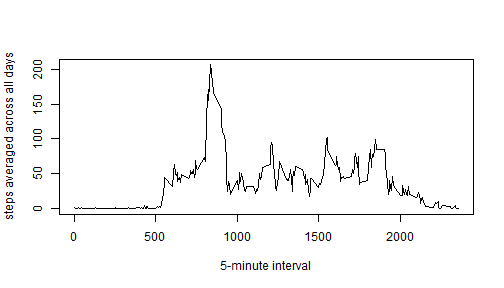
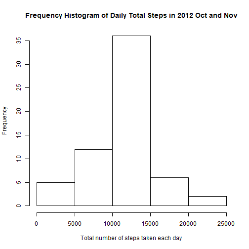
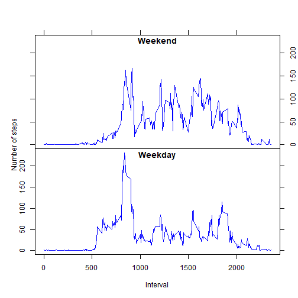

## Loading and preprocessing the data

```r
Activity = read.csv("C:/DataScience/Course_5_Reproducible_Research/RepData_PeerAssessment1/activity.csv")
Activity = Activity[complete.cases(Activity),]
```

## What is mean total number of steps taken per day?

```r
Daily_Activity = aggregate(steps ~ date, Activity, sum)
```

Make a histogram of the total number of steps taken each day

```r
hist(Daily_Activity$steps, main = paste0("Frequency Histogram of Daily Total Steps in 2012 Oct and Nov"), xlab = c("Total number of steps taken each day"))
```


Mean and Median total number of steps taken per day

```r
dddd1 = as.integer(mean(Daily_Activity$steps))
dddd2 = as.integer(median(Daily_Activity$steps))
```
The mean total number of steps taken per day is 10766
The median total number of steps taken per day is 10765

## What is the average daily activity pattern?
Make a time series plot (i.e. type = "l") of the 5-minute interval (x-axis) and the average number of steps taken, averaged across all days (y-axis)

```r
Avg_Daily_Pattern = aggregate(steps ~ interval, Activity, mean)
plot(Avg_Daily_Pattern$interval, Avg_Daily_Pattern$steps, type = "l", xlab = "5-minute interval", ylab = "steps averaged across all days")
```



Max steps in the above pattern

```r
ddd = Avg_Daily_Pattern$interval[Avg_Daily_Pattern$steps == max(Avg_Daily_Pattern$steps)]
```
The 5-minute interval 835, on average across all the days in the dataset, contains the maximum number of steps


## Imputing missing values
Calculate and report the total number of missing values in the dataset (i.e. the total number of rows with NAs)

```r
Activity = read.csv("C:/DataScience/Course_5_Reproducible_Research/RepData_PeerAssessment1/activity.csv")
ddd = sum(is.na(Activity$steps))
```
The total number of missing values is 2304

Filling in all of the missing values with the mean for that 5-minute interval

```r
for (i in 1:nrow(Activity)) {
    if (is.na(Activity$steps[i])) {
        Activity$steps[i] = Avg_Daily_Pattern$steps[Avg_Daily_Pattern$interval == Activity$interval[i]]
    }
}
```
Create a new dataset that is equal to the original dataset but with the missing data filled in.

```r
New_Activity = Activity
```
Make a histogram of the total number of steps taken each day 

```r
New_Daily_Activity = aggregate(steps ~ date, New_Activity, sum)
hist(New_Daily_Activity$steps, main = paste0("Frequency Histogram of Daily Total Steps in 2012 Oct and Nov"), xlab = c("Total number of steps taken each day"))
```



Mean and Median total number of steps taken per day

```r
ttt1 = as.integer(mean(New_Daily_Activity$steps))
ttt2 = as.integer(median(New_Daily_Activity$steps))
```

Mean total number of steps taken per day is 10766
Median total number of steps taken per day is 10766

Impact of imputing missing data

```r
difference1 = ttt1 - dddd1
difference2 = ttt2 - dddd2
```
the change of imputing missing data on Mean total daily steps is 0.
the change of imputing missing data on Median total daily steps is 1.


## Are there differences in activity patterns between weekdays and weekends?
Create a new factor variable in the dataset with two levels -- "weekday" and "weekend" indicating whether a given date is a weekday or weekend day.

```r
New_Activity$Days = factor(weekdays(as.Date(New_Activity$date)), labels = c("weekday", "weekday", "weekend", "weekend", "weekday", "weekday", "weekday"))
```
Make a panel plot containing a time series plot (i.e. type = "l") of the 5-minute interval (x-axis) and the average number of steps taken, averaged across all weekday days or weekend days (y-axis).

```r
Avg_Daily_Pattern_weekdayweekend = aggregate(steps ~ interval + Days, New_Activity, mean)
ylim = range(0, max(Avg_Daily_Pattern_weekdayweekend$steps))
par(mfrow = c(2, 1))
par(mar = c(0, 4.1, 4.1, 2.1))
plot(Avg_Daily_Pattern_weekdayweekend$interval[Avg_Daily_Pattern_weekdayweekend$Days == c("weekend")], Avg_Daily_Pattern_weekdayweekend$steps[Avg_Daily_Pattern_weekdayweekend$Days == c("weekend")], type = "l", col = "blue", xlab = "", ylab = "", xaxt = "n", yaxt = "n", ylim = ylim)
mtext("Number of steps", line = 2, side = 2, at = 1)

title("Weekend", line = -1)
axis(4, labels = TRUE, tick = TRUE)
axis(2, labels = FALSE)
axis(3, labels = FALSE)
par(mar = c(5.1, 4.1, 0, 2.1))
plot(Avg_Daily_Pattern_weekdayweekend$interval[Avg_Daily_Pattern_weekdayweekend$Days == c("weekday")], Avg_Daily_Pattern_weekdayweekend$steps[Avg_Daily_Pattern_weekdayweekend$Days == c("weekday")], type = "l", col = "blue", xlab = "Interval", ylab = "", ylim = ylim)
title("Weekday", line = -1)
axis(4, labels = FALSE)
```


